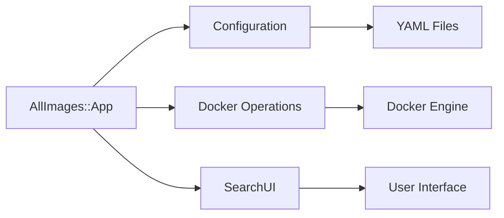

# AllImages - Runs a script in all of the docker images

## Description 📝

AllImages is a Ruby-based command-line tool that automates running scripts
across multiple Docker images. It provides a configuration-driven approach to
testing and executing code in containerized environments, supporting both batch
execution and interactive debugging.

## Architecture Overview 🏗️

AllImages follows a well-defined architectural pattern with clear separation of
concerns between several key components:

### Core Components 🧩

**Application Class** (`AllImages::App`)
- The central hub managing command-line interface, configuration loading, and
  Docker operations 🔄
- Handles command processing and execution flow 🚦
- Manages Docker image building, tagging, and cleanup 🔧
- Provides environment variable handling and error reporting 🛡️

**Configuration Manager** (`AllImages::Config`)
- Centralized configuration handling via YAML files 📄
- Manages default configuration generation and loading 🔄
- Provides example configuration templates 📋

### Component Interactions 🔄



The `AllImages::App` acts as the main coordinator, loading configuration files
and orchestrating Docker operations. The SearchUI enables interactive image
selection, while Docker operations handle the actual container execution.

### Loading Mechanism 📥

AllImages supports automatic configuration file generation when none exists:

1. **Automatic initialization** when `.all_images.yml` is missing 🚨
2. **Configuration loading** from specified YAML files 📁
3. **Default configuration** with example content provided 📋

### Command Execution Flow 🔄

AllImages supports multiple execution modes:

- **Batch execution**: Run scripts across all configured images (`run_all`)
- **Selective execution**: Run scripts on specific images (`run <image>`)
- **Interactive debugging**: Debug scripts in containerized environments (`debug <image>`)
- **Listing**: Display available images (`ls`)
- **Help**: Show usage information (`help`)

## Use Case: Multi-Version Ruby Testing 🧪

AllImages is particularly useful for running tests/specs across different Ruby
versions and platforms. This makes it an excellent tool for:

- **Cross-version compatibility testing** - Ensuring your code works across
  multiple Ruby versions
- **Platform consistency verification** - Testing on different operating
  systems and environments
- **CI/CD pipeline automation** - Automating test execution across multiple
  environments
- **Dependency resolution testing** - Verifying how your code behaves with
  different dependency versions

### Example: Ruby Version Testing

```yaml
dockerfile: |-
  RUN apk add --no-cache build-base yaml-dev openssl-dev git
  RUN gem update --system
  RUN gem install bundler gem_hadar

script: &script |-
  echo -e "\e[1m"
  ruby -v
  echo -e "\e[0m"
  bundle update --all
  bundle install --jobs=$(getconf _NPROCESSORS_ONLN)
  rake spec

fail_fast: true

images:
  ruby:3.4-alpine: *script
  ruby:3.3-alpine: *script
  ruby:3.2-alpine: *script
  ruby:3.1-alpine: *script
```

This configuration automatically runs your test suite across Ruby 3.4, 3.3,
3.2, and 3.1, ensuring compatibility across versions.

## Installation 📦

You can install AllImages via RubyGems:

```bash
gem install all_images
```

Or add it to your Gemfile:

```ruby
gem 'all_images'
```

## Usage 🛠️

### Basic Workflow

1. Run `all_images` to generate a default `.all_images.yml` configuration file
2. Customize the configuration file to define your Docker images and scripts
3. Execute commands to run scripts across images

### Command Examples 📋

```bash
# Run scripts across all configured images
all_images run_all

# Or

all_images

# Run script on a specific image
all_images run ruby:3.4-alpine

# Debug script in a specific image interactively
all_images debug ruby:3.4-alpine

# List available images
all_images ls

# Show help information
all_images help
```

### Configuration File Structure 📄

Given a configuration file like `.all_images.yml`:

```yaml
dockerfile: |-
  RUN apk add --no-cache build-base yaml-dev openssl-dev git
  RUN gem update --system
  RUN gem install bundler gem_hadar

script: &script |-
  echo -e "\e[1m"
  ruby -v
  echo -e "\e[0m"
  bundle update --all
  bundle install --jobs=$(getconf _NPROCESSORS_ONLN)
  rake spec

fail_fast: true

images:
  ruby:3.4-alpine: *script
  ruby:3.3-alpine: *script
  ruby:3.2-alpine: *script
```

### Environment Variables 🧪

AllImages supports environment variable handling:
- Configuration-defined environment variables are passed to containers
- `TERM` environment variable is automatically included if present
- Variables can be specified in the configuration file using `env` key

### Docker Integration 🔧

The tool automatically:
- Pulls base Docker images from Docker Hub
- Builds custom Docker images with scripts
- Runs containers with proper volume mounting
- Cleans up containers after execution
- Supports both interactive and non-interactive modes

## Advanced Features 🚀

### Interactive Debugging 🛠️

```bash
# Start interactive session in container
all_images debug ruby:3.4-alpine
```

This provides a shell prompt inside the container for debugging scripts.

### Failure Handling ⚠️

The `fail_fast` configuration option stops execution on first failure:
```yaml
fail_fast: true
```

### Searchable Image Selection 🎯

When no image is specified, AllImages provides an interactive search interface:
```bash
all_images run
# Shows searchable list of available images
```

## Error Handling ⚠️

AllImages provides comprehensive error handling for common scenarios:

### Configuration Errors 📁
- Missing configuration file (automatically generates example)
- Invalid YAML syntax in configuration files

### Docker Errors 🔧
- Failed Docker image pulls
- Build failures
- Container execution errors

### Command Errors 🚨
- Invalid command-line arguments
- Missing required parameters

### Container Cleanup

AllImages ensures proper cleanup of Docker containers even on failures:
- Automatic removal of containers after execution
- Temporary build directories are cleaned up automatically

### Logging

The tool provides colored output for better visibility:
- Success messages in green
- Failure messages in red
- Informational messages in white with blue background

## Configuration ⚙️

### Default Configuration

When no `.all_images.yml` file exists, AllImages generates a default
configuration with example content:

```yaml
dockerfile: |-
  RUN apk add --no-cache build-base yaml-dev openssl-dev git
  RUN gem update --system
  RUN gem install bundler gem_hadar

script: &script |-
  echo -e "\e[1m"
  ruby -v
  echo -e "\e[0m"
  bundle update --all
  bundle install --jobs=$(getconf _NPROCESSORS_ONLN)
  rake spec

fail_fast: true

images:
  ruby:3.4-alpine: *script
  ruby:3.3-alpine: *script
  ruby:3.2-alpine: *script
```

## Security Considerations ⚠️

### Docker Security
- Containers run with mounted current directory for script access
- Temporary build directories are cleaned up automatically
- No privileged operations are performed

### Script Security
- Scripts are executed within isolated Docker containers
- No direct access to host system (except mounted directories)
- Container cleanup ensures no residual artifacts

## Download 📥

The homepage of this library is located at

* https://github.com/flori/all_images

## Author 👨‍💻

[Florian Frank](mailto:flori@ping.de)

## License 📄

This software is licensed under the [MIT license](LICENSE)
